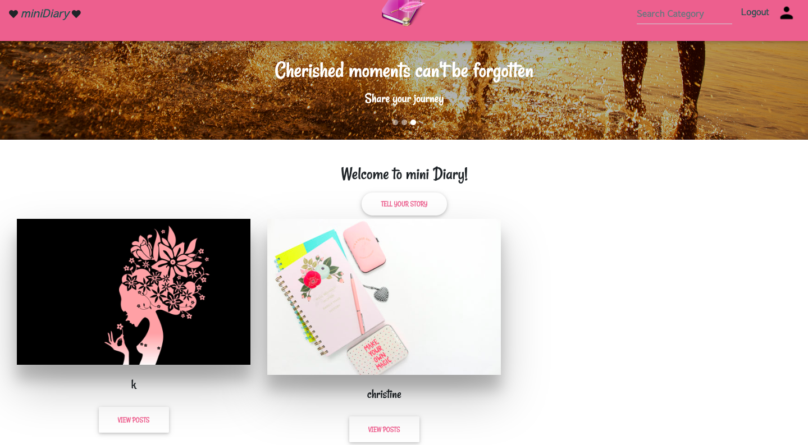
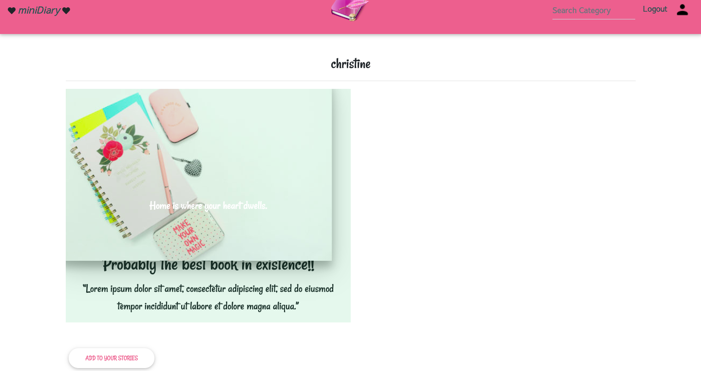

## Table of contents
*  [AppName](#Mini-Diary)
*  [Author](##Author-Chris)
*  [Description](##App-Description)
*  [Screenshots](###App-screenshots)
*  [SetUp](##Setup-Installation)
*  [Installation](##App-Requirements)
*  [BDD](##Behavior-Driven-Development)
*  [Bugs](###Known-Bugs)
*  [TechnologiesUsed]( ##Technologies-Used)
*  [Supportandcontactdetails](##Support-and-contact-details)
*  [License](##App-License)

# Mini Diary

An application that allows users living their best lives to share their experiences and adventures with their online friends keep in touch with their fellow fun loving friends and recommend fun activities or places to other people. 

#### Author: Chris

## Description
View live site: coming soon

This is a web platform for users living their best lives to share their experiences and adventures with their online friends. Users create an account to join a community and can share of any memorable experience they might have been part of. Users can also reccomend certain activities to other people by sharing images and posting reviews. 

## Application Structure
#### Folders:

~ diaryApp- this is the main application.
~ Static - holds any content that can be delivered to an end user without having to be generated, modified, or processed.
~ Media - holds all images uploaded to the application by the user.
~ Templates - it holds HTML files with variables and other programming constructs.
~ Virtual - helps to keep dependencies required by different projects separate by creating isolated python virtual environments for them.

#### Files:

~ manage.py - responsible for running commands and starting the development server
~ requirements.txt - hold the result from pip freeze for the purpose of achieving repeatable installations.


## App  
### Landing page
 

### Sign up page


### User profile page


## Setup/Installation 

## Setup
To run this project, install it locally using the following commands:
* Ensure you have python and pip installed beforehand.

```
$ git clone https://github.com/ChristineKarimi/miniDiary.git
$ cd miniDiary
$ python3 -m venv virtual
$ source virtual/bin/activate
$ python3 -m pip install -r requirements.txt
$ python manage.py runserver
```

* The application should work at this point.

## Requirements

Use the package manager [pip](https://pip.readthedocs.io/en/1.1/requirements.html) to install all depedencies.

```bash
python3 -m pip install -r requirements.txt`
```

## Prepare environmet variables
For this project you will need the following configurations, inside an environment file that is to be ignored.

```python
SECRET_KEY=''
DEBUG=True #set to false in production
DB_NAME='' # your db username
DB_USER='' # your user
DB_PASSWORD='' #your db password
DB_HOST='127.0.0.1'
MODE='dev' #set to 'prod' in production
ALLOWED_HOSTS='.localhost', '.herokuapp.com', '.127.0.0.1'
```


## Behavior Driven Development (BDD)
| Behavior | Input    | Output   |
| :------------- | :------------- | :------------- |
| User authentication | click on the sign up button  | registration form |
| Profile editing | Click on edit profile button  | profile page form|
| User can view details of a single post | Click on a specific post  | Profile page details form |
| User can search for specific stories | Input a keyword on the search bar | Results-page |
| User can view stories related to what their interests| Clicks on shared posts button| Feeds Page |

## Known Bugs
Some of the features are still under development and will be constantly updated. 

## Technologies Used
The application is built on:
* Python3
* Javascript/Jquery/Ajax
* Bootstrap 4
* MDB Bootstrap
* Django 1.11 framework
* Postgresql 

## Support and contact details
For any queries and suggestions, please contact the support team via **Email: karimikim3@gmail.com**

## TODO
- [ ]Add review functionality for each entry.<br>
- [ ]mprove on the design.

## License
[MIT](https://choosealicense.com/licenses/mit/)

Copyright (c) 2019 **christine Karimi**
