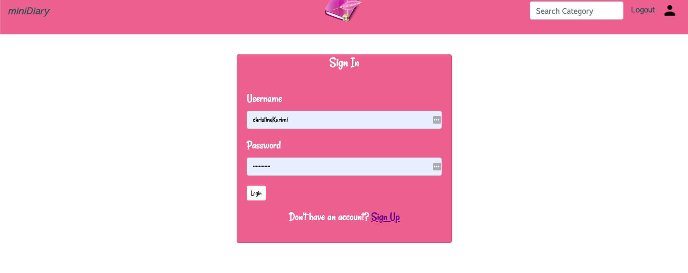

## Table of contents
*  [AppName] (#Mini Diary)
*  [Author] (Author: Chris)
*  [Description] (## Description)
*  [Screenshots] (### App)
*  [SetUp] (## Setup/Installation)
*  [Installation] (## Requirements)
*  [BDD] (## Behavior Driven Development (BDD))
*  [Bugs] (### Known Bugs)
*  [TechnologiesUsed]( ## Technologies Used)
*  [Supportandcontactdetails] (## Support and contact details)
*  [License](## License)

# Mini Diary

An application that allows users living their best lives to share their experiences and adventures with their online friends. Keep in touch with their fellow fun loving friends and recommend fun activities or places to other people. 

#### Author: Chris

## Description
View live site: coming soon

This is a web platform for users living their best lives to share their experiences and adventures with their online friends. Users create an account to join a community and can share of any memorable experience they might have been part of. Users can also reccomend certain activities to other people by sharing images and posting reviews. 

## App  
### Landing page
 

### Sign up page


### User profile page


## Setup/Installation 

## Setup
To run this project, install it locally using the following commands:
* Ensure you have python and pip installed beforehand.

```
$ git clone https://github.com/ChristineKarimi/miniDiary.git
$ cd miniDiary
$ python3 -m venv virtual
$ source virtual/bin/activate
$ python3 -m pip install -r requirements.txt
$ python manage.py runserver
```

* The application should work at this point.

## Requirements

Use the package manager [pip](https://pip.readthedocs.io/en/1.1/requirements.html) to install all depedencies.

```bash
python3 -m pip install -r requirements.txt`
```

## Behavior Driven Development (BDD)
| Behavior | Input    | Output   |
| :------------- | :------------- | :------------- |
| User authentication | click on the sign up button  | registration form |
| Profile editing | Click on edit profile button  | profile page form|
| User can view details of a single post | Click on a specific post  | Profile page details form |
| User can search for specific stories | Input a keyword on the search bar | Results-page |
| User can view stories related to what their interests| Clicks on shared posts button| Feeds Page |

## Known Bugs
Some of the features are still under development and will be constantly updated. 

## Technologies Used
The application is built on:
* Python3
* Javascript/Jquery/Ajax
* Bootstrap 4
* MDB Bootstrap
* Django 1.11 framework
* Postgresql 

## Support and contact details
For any queries and suggestions, please contact the support team via **Email: karimikim3@gmail.com**

## License
[MIT](https://choosealicense.com/licenses/mit/)

Copyright (c) 2019 **christine Karimi**
